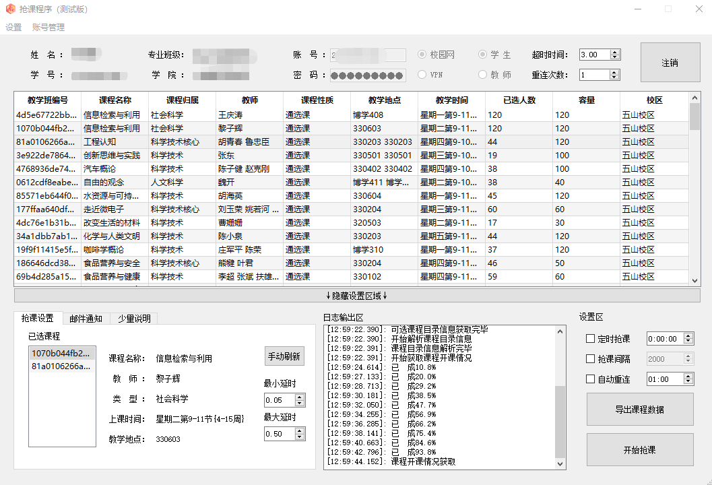
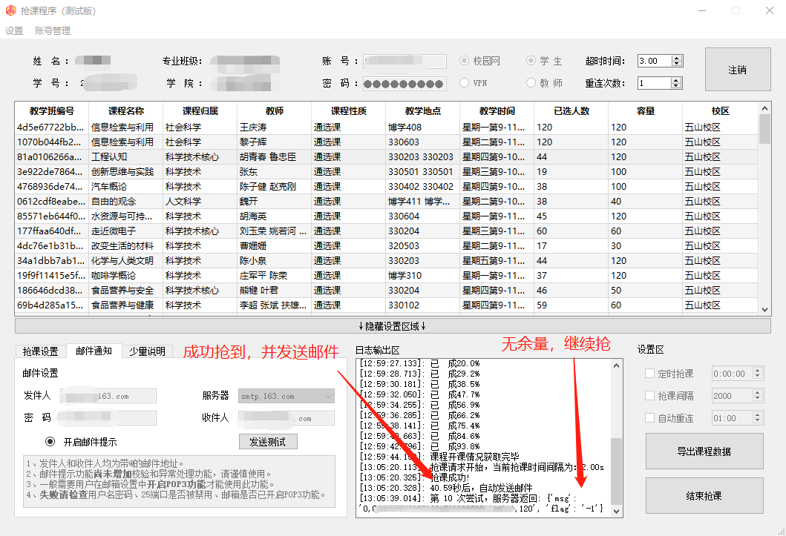
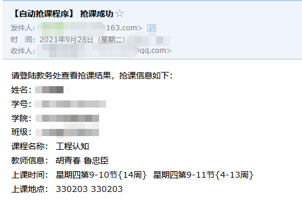

# 华工抢课程序
# scut_rob_class

**准备弃坑开发C#版**

**注意！此版本为测试版，仅在正常逻辑操作范围内进行测试，可能存在未知BUG，如有问题请提交[issue](https://github.com/CubicSum/scut_rob_class/issues)**

**为防止该程序被恶意使用，暂时不提供源码，仅提供可执行文件，后续可能依据使用情况进行开源**

## 使用该程序你可以做到
:heavy_check_mark: 无人值守自动抢课\
:heavy_check_mark: 并发抢课提升成功率\
~~:heavy_check_mark: 定时抢课~~（暂不开放）\
~~:heavy_check_mark: 连接有效检测及恢复~~（暂不开放）

## 使用该程序你不能做到
~~:x: 违反选课规则选课~~（这是教务员的权限）\
:x: 提高您的网速\
:x: 保证一定可以抢到课

## 系统环境支持程度
最佳支持：Window 10\
:heavy_check_mark:Windows\
:x: Linux\
:x: macOS

## 下载
抢课程序[下载地址](https://github.com/CubicSum/scut_rob_class/releases)

## 简单使用说明
1. 程序输入账号密码，选择接口（校园网、VPN、学生、教师选项）登录
2. 点击 抢课设置->手动刷新,等待程序获取课程信息
3. 双击课程信息，将其添加进抢课队列中
4. 点击开始抢课

## 其他使用说明
### 连接相关设置
1. 超时时间为等待服务器响应的最大时间
2. 重连次数为请求失败后再次发起的次数

### 登录相关设置
1. 校园网是使用内网接口（外网不可用），VPN是使用VPN接口（外网可用）
2. 学生、教师选项和进入教务系统可选的学生、教师分别对应

### 抢课设置
1. 可双击队列中的选项查看具体课程信息
2. 可右键移除已选课程

### 开始抢课设置
~~1. 定时抢课可使程序在设定时间自动开始允许~~（暂不开放）\
2. 抢课间隔可修改发起请求的频率\
~~3. 自动重连可检测连接有效性及自动恢复~~（暂不开放）

### 邮件通知
1. 开启邮件提示后，可使程序完成抢课后发送邮件进行提示（未处理配置错误的情况，出错无法发送邮件）

### 运行截图

登录刷新课程，并加入队列

抢2门课（有余量、无余量各一门）

邮件提示

## 抢课说明
- **本程序所有操作均保证当前课程不会减少，即无论你是否已经选上课、无论是否人满等各种情况都不会影响已选课程。换言之，无论何时均保证课程只多不少，重复提交不会影响当前课表。**
- 程序理论上不适用于刚开放选课时抢先登入校园网进行抢课这一情况，仅提供被筛出并无法第一时间抢到课后的弥补性操作。
- 抢课队列中的课程均分配单一线程进行抢课，互不冲突。
- 可选择任意课，程序目前会根据服务器返回字段，自动结束冲突课程的抢课。
